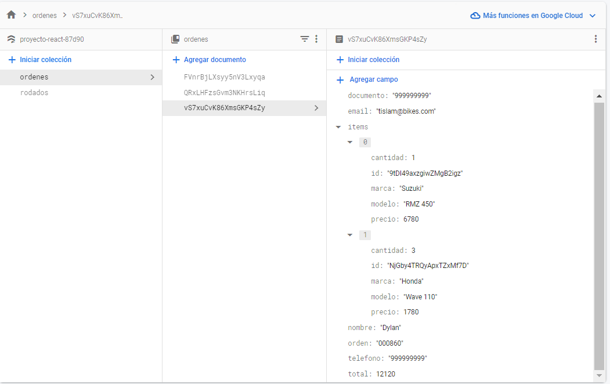

# E-commerce de venta de motocicletas

## Descripción general

Una web diseñada para la venta de motocicletas al consumidor final. Cuenta con un gestor de ordenes que se almacenan en una base de datos no relacional. Se utilizaron librerías de estilo como (chakra-ui) para crear una visual ordenada.

## Multimedia




## Librerías utilizadas

- [Chakra-ui](https://chakra-ui.com/) - Librería de estilo predeterminados.
- [React-router-dom](https://reactrouter.com/en/main) - Para la creación de rutas dinámicas.
- [Firebase](https://firebase.google.com/) - Base de datos NoSQL.

## Installation

En líneas de comando, ingresar al root y correr el siguiente código.

```
npm run dev
```

## Proyecto en la web

| Página   | Link                                                                                                                                                   |
| -------- | ------------------------------------------------------------------------------------------------------------------------------------------------------ |
| GitHub   | [https://github.com/DylanDeSantis](https://github.com/DylanDeSantis/react)                                                                             |
| Firebase | [console.firebase.google.com](https://console.firebase.google.com/project/proyecto-react-87d90/firestore/data/~2Fordenes~2FvS7xuCvK86XmsGKP4sZy?hl=es) |

## License

MIT
**Free Software**
